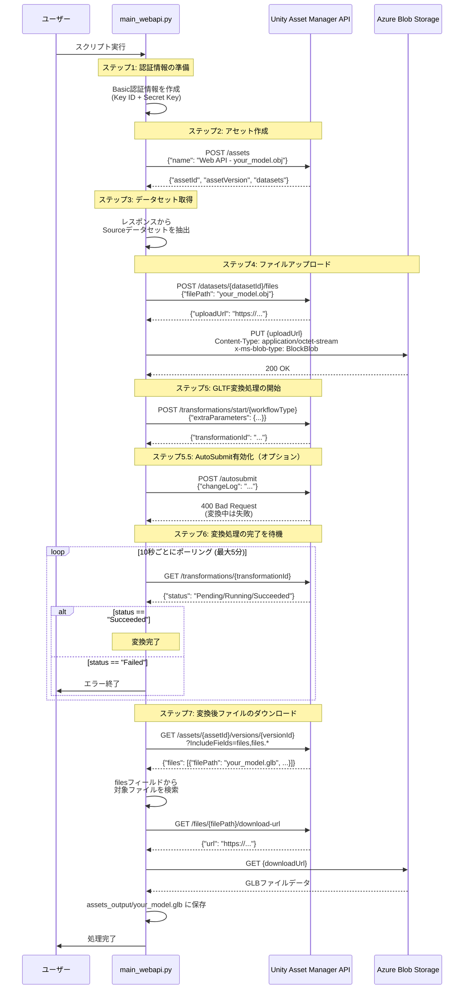
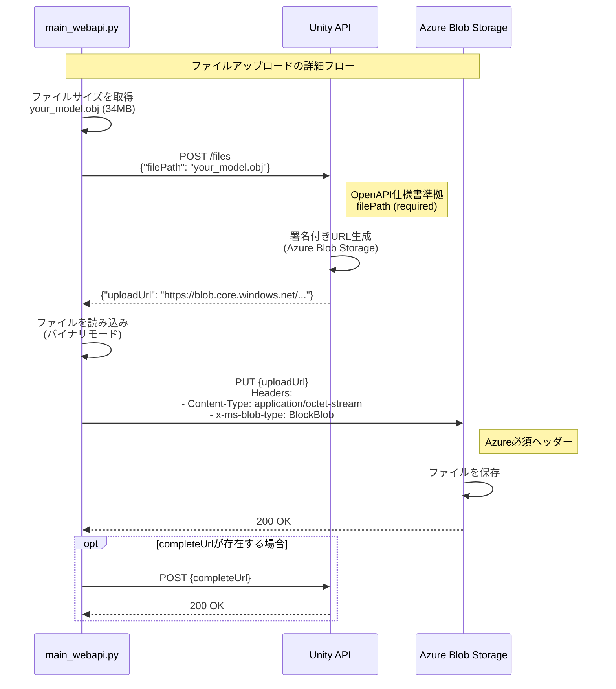
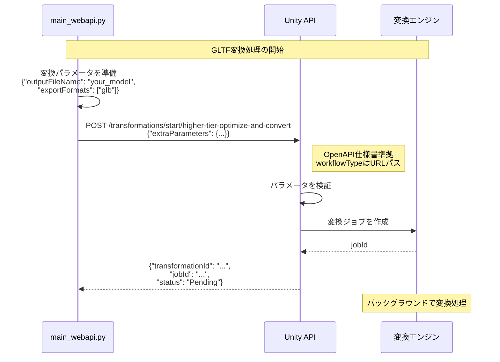
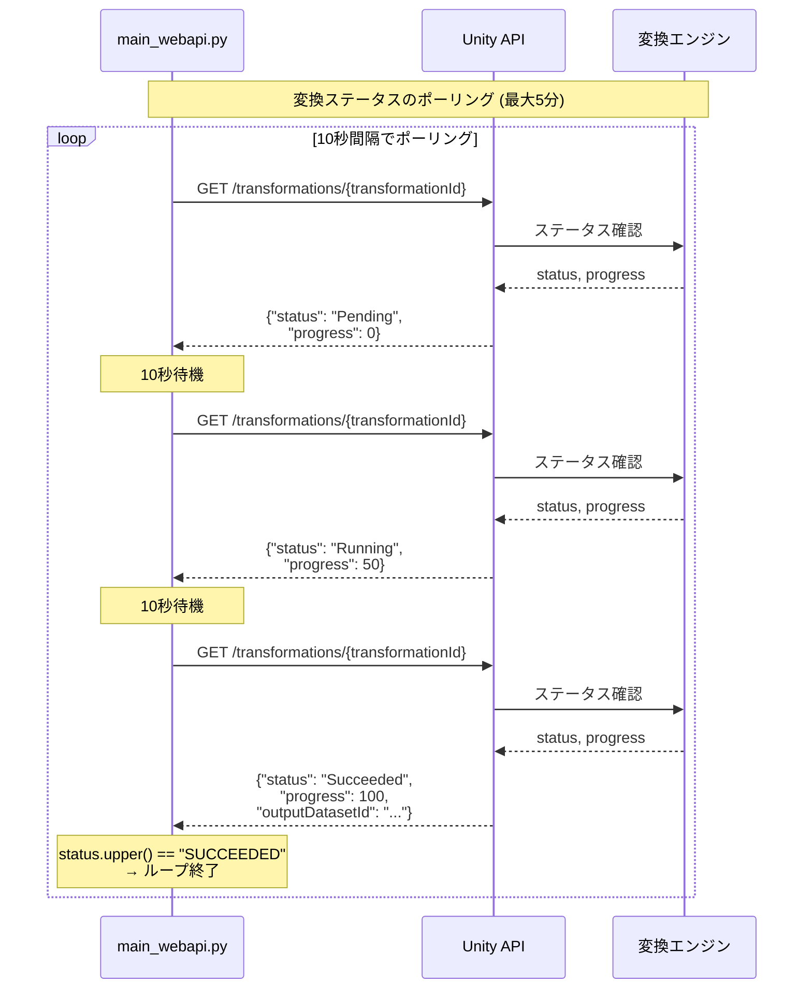
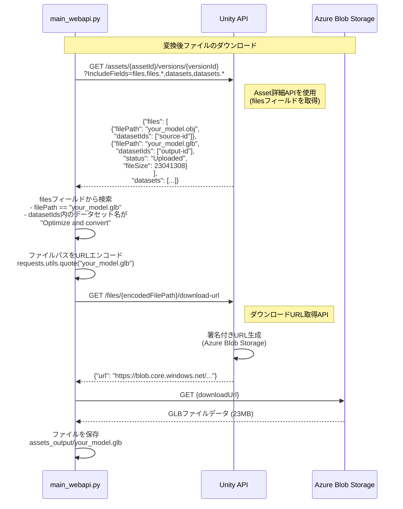
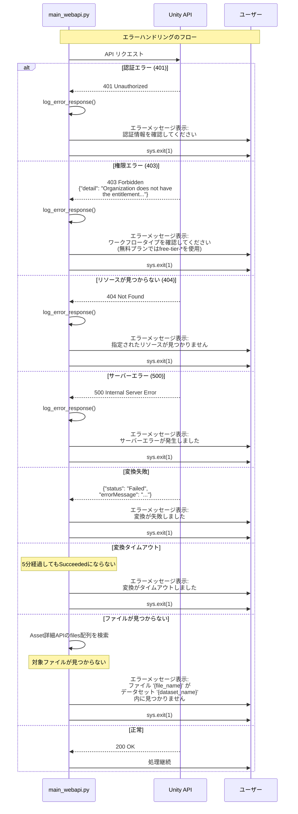
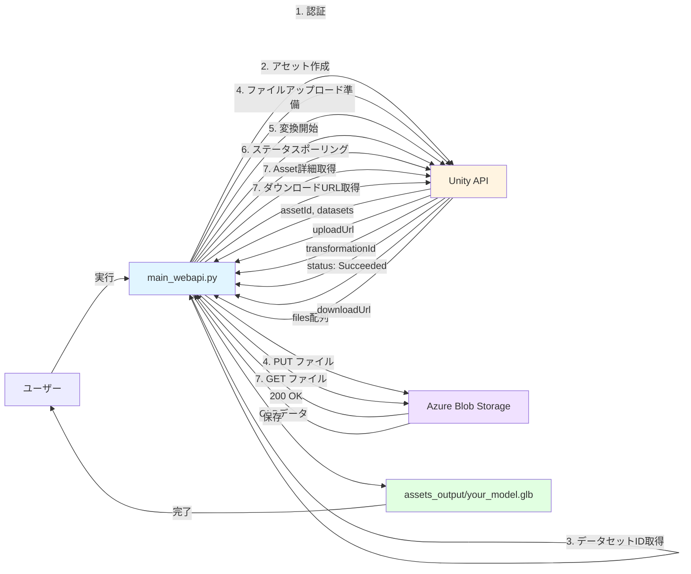
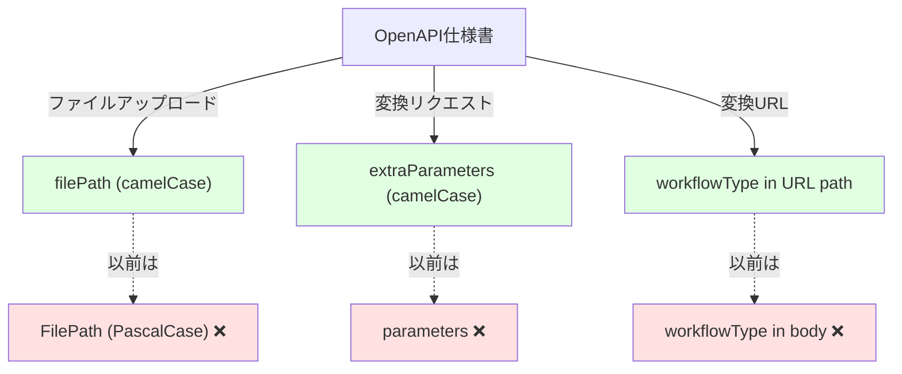
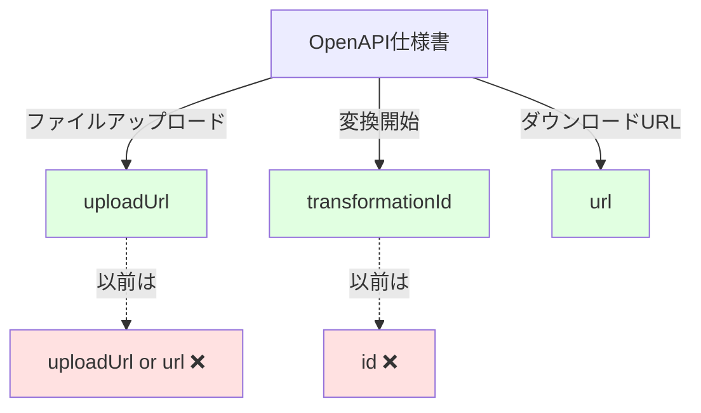

# Unity Asset Manager REST API - シーケンス図

main_webapi.pyの処理フローを示すシーケンス図です。

## 全体フロー

## 詳細フロー（各ステップ）

### ステップ4: ファイルアップロード詳細

### ステップ5: 変換処理開始詳細

### ステップ6: ステータスポーリング詳細

### ステップ7: ファイルダウンロード詳細

## エラーハンドリング

## データフロー

## OpenAPI仕様書準拠のポイント

### リクエストフィールド名

### レスポンスフィールド名

